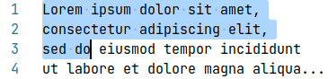

# text-position-rs

Provide text position representations and range of them.

## Features

**[TextPosition](./src/position.rs)** is a *trait* with some instances:

- `Utf8Index`: newtype of `u32`
- `Utf8Position`: row-column pair in UTF-8.
- `Utf16Position`: row-column pair in UTF-16. Could be used for LSP, Win32 API, etc.
- `CompositePosition`: All-in-one of the above three.

**[TextRange&lt;P&gt;](./src/range.rs)** is a type parameterized  over `P: TextPosition`.

## Install

*TODO: Publish to crates.io*

### Cargo feature flags

- `checked`: insert runtime checks for consistency of `CompositePosition`.

Usage:

```toml
text-position-rs = { ..., features = ["checked"] }
```

## Examples

Position:

```rust
use text_position_rs::Utf8Position;

let pos = Utf8Position::new(2, 6);
assert_eq!(format!("{}", pos), "3:7");
```

Range:

```rust
use text_position_rs::Utf8Position;

let start = Utf8Position::new(2, 4);
let end = Utf8Position::new(4, 8);
let range = TextRange::from(start..end);
assert_eq!(format!("{}", range), "3.5-5.9");
```

## See also

Similar libraries:

- [rust-analyzer/text-size](https://github.com/rust-analyzer/text-size)
    - `TextSize`: newtype of u32 as UTF-8 index
    - `TextRange`: range of `TextSize`

## Appendix: Theory behind design

`TextPosition` requires a constant and two operations:

- ZERO: the origin of position
- addition (`+`)
- saturating_sub: subtraction (`-`) but returning ZERO instead of negative

`Utf8Index`, which is just a non-negative integer, supports these operations obviously. What about `Utf8Position`?

### Addition of row-column pairs

`Utf8Position` is a row-column pair. Introduce consistent addition and subtraction on it with analogue to string concatenation.

Imagine there is a text document and some position is chosen, say (2, 6). Select from the start of document to the chosen position:



There are two properties about row-number pair of the position and selected string:

- The row number, which starts from 0 here, equals to the **number of newlines** (`\r\n` or `\n`) in the selected string.
- The column number, which starts from 0 here, equals to the **length of the final line** in the selected string.

Map from a row-column pair to a string that consists of `row` newlines and `column` bytes after that: for example, (2, 6) <-> `"\n\n123456"`.

Define the addition of row-column pairs by concatenating such strings. For example,

```rust
(2, 6) + (0, 2)
→ "\n\n123456" + "12"
→ "\n\n12345612"
→ (2, 8)
```

```rust
(2, 6) + (1, 2)
→ "\n\n123456" + "\n12"
→ "\n\n123456\n12"
→ (3, 2)
```

Write in mathematical notation:

```
         +          : ℕ×ℕ → ℕ×ℕ → ℕ×ℕ
(r1, c1) + ( 0, c2) = (r1     , c1 + c2)
(r1, c1) + (r2, c2) = (r1 + r2,      c2)   if r2 > 0
```

Note `(ℕ×ℕ, (0, 0), +)`, where `+` is defined as above, is an instance of monoid.

### Saturating subtraction of row-column pairs

The saturating_sub, written as `x \ y`, is inversion of the addition.

Define the saturating_sub of row-column pairs by prefix-stripping of corresponding strings. For example,

```rust
(2, 8) \ (2, 6)
= "\n\n12345678" \ "\n\n123456"
=           "78"
= (0, 2)
```

```rust
(3, 2) \ (2, 6)
= "\n\n\n12" \ "\n\n123456"
= "\n\n\n12" \ "\n\n"
=     "\n12"
= (1, 2)
```

Write in mathematical notation:

```
         \          : ℕ×ℕ → ℕ×ℕ → ℕ×ℕ
(r1, c1) \ (r2, c2) = (0, 0)           if (r1, c1) ≤ (r2, c2)
(r1, c1) \ (r2, c2) = (0, c1 - c2)     if r1 = r2 and c1 > c2
(r1, c1) \ (r2, c2) = (r1 - r2, c2)    if r1 > r2
```

where ordering is lexicographical.
